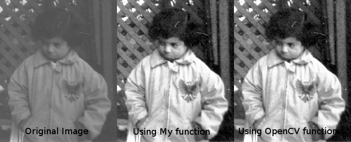

# Video-Summarization
Using OpenCV for Python

<h3>Project Highlights </h3>
 
<h4>Reading and Writing Images :</h4>
Reading images using OpenCV functions : <strong>img_matrix = cv2.imread(src, conversion)</strong> -> src is the name of the image and conversion can be 0 for grayscale and 1 for coloured images. One can also use OpenCV constants as cv2.IMREAD_GRAYSCALE for grayscale and cv2.IMREAD_COLOR for coloured(without any alpha factor) and cv2.IMREAD_UNCHANGED for loading the alpha factor(transparency). 
 
 
Writing images using OpenCV functions :<strong>cv2.imwrite(dst, src)</strong> -> dst is the name of the desired file name saving the image and src is the image matrix 
 
 
Showing images: <strong> imshow(title, img_matrix) </strong> -> title can be set to  any string and img_matrix is the image matrix
 
 

<strong>Forming Histogram </strong> : Counting the frequency of all the intensities starting from 0 to 255 and then plotting the frequency distribution using pylab. Example h is the array containing frequency distribution then  
<code>import pylab as plt </code>  
<code> plt.title('Title') </code>  
<code> plt.plot(h) </code>  
<code> plt.show() </code>  

 
 

<strong>Histogram Equalization </strong>: A technique for image enhancement  
Results of Histogram equalizations and comparisons with and without using OpenCV functions 

